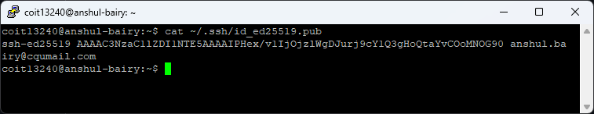
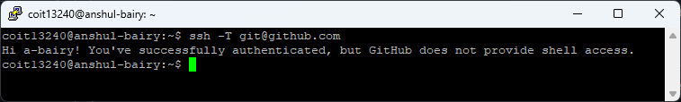
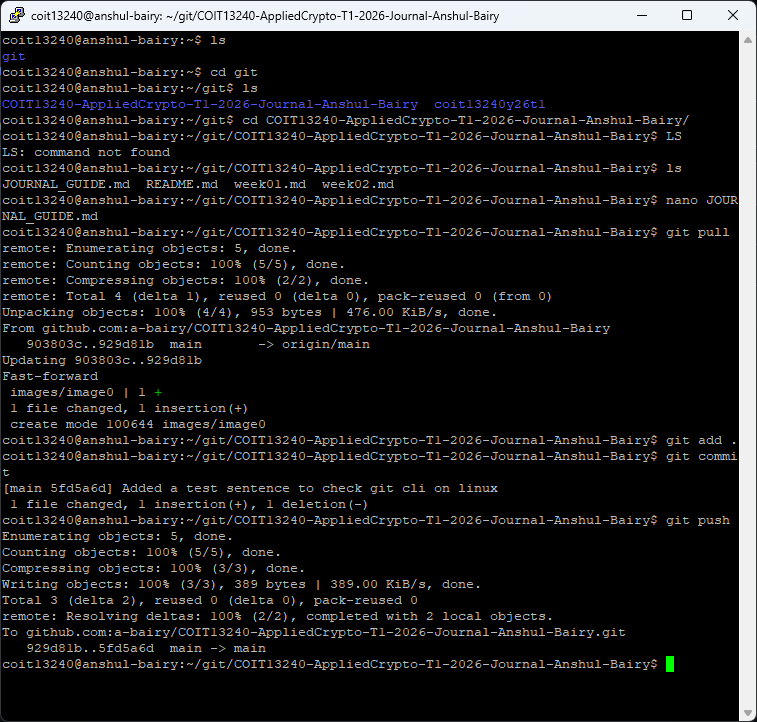

# Week 1

[Return to contents](README.md)

---

## Lecture Notes - Cryptographic Concepts, Terminology & Tools
I wrote out all the lecture concepts by hand because I find writing stuff out helps me remember it way better than just reading slides. My notes cover the CIA Triad, AAA Model, the encryption model with the formulas, symmetric vs asymmetric, and Caeser cipher worked examples.


---

## Tutorial Tasks
### Setting up VirtualBox and PuTTY

This part was pretty easy for me. I already had VirtualBox and PuTTY set up from my System and network Admin unit (COIT12146) that I'm also doing this term, so it was just the same thing again. The only thing I had to do was to create another VM on VirtualBox. I've added a new Port forwarding rule with SSH (`127.0.0.1:2201` pointing to guest port `22`).

I've also used LInux before - I rented a server from Oracle Cloud a while back and had to use the command line to set up a VPN on it. I was googling every command back then but it got me comfortable enough with the basics like `cd`, `ls`, `nano` etc.


### SSH Key Generation
This was honestly the hardest part of the week for me. I couldn't get into the 2026 tutorial recording on Moodle so I was watching the 2024 Echo360 recording by Steve Gordan, and the steps didn't exactly match up with what I needed to do.

I kept trying different things in PuTTY until I figured out the right command:

```bash
ssh-keygen -t ed25519 -C "anshul.bairy@cqumail.com"
```

Then I had to get the public key and put it on GitHub:

```bash
cat ~/.ssh/id_ed25519.pub
```

Copied the output (in PuTTY you just select the text and it copies automatically, which I didn't know at first) and pasted it into GitHub under SEttings > SSH Keys.



Tested it with:
```bash
ssh -T git@github.com
```

And it worked, got the "successfully authenticated" message.



The thing that clicked for me here was that this is literally the asymmetric encryption stuff from the lecture but in practice. Private key stays on my machine, public key goes to GitHub. They verify each other mathematically instead of using a password. Before doing this I understood the concept from the slides but it didn't really make sense until I actually did it.

### Git Clone, Commit, Push
This was easy since I've been using Git for about a month now for my personal notes. Cloned both my journal repo and the unit's private repo:
```bash
mkdir git
git clone git@github.com:Umair-Ullah-Tariq/coit13240y26t1.git
git clone git@github.com:a-bairy/COIT13240-AppliedCrypto-T1-2026-Journal-Anshul-Bairy.git
```

I later moved them into `git` folder using `mv` to keep things organized.

One thing that tirpped me up was when I tried to commit for the first time it threw an error saying I need to set my global email and user name. Had to run:

```bash
git config --global user.email "anshul.bairy@cqumail.com"
git config --global user.name "Anshul Bairy"
```

After that everything worked fine. Add, commit, push & DONE.


---

## Reflections
**Easiest Part:** VirtualBox + PuTTY setup. I've done it before for COIT12146 so there was nothing new here.
**Hardest Part:** SSH keys. I didn't understand why we were typing these commands or what they were doing. I was just experimenting until something worked. But after getting it to work and thinking about it, I get it now. Using SSH keys to push directly from VM to GitHub is way easier than the alternative (like using FileZilla to copy files to Windows and then uploading to GitHub through the browser). The key setup is annoying but you only do it once.
**What I'd do differently:** Check Echo360 earlier when Moodle recordings aren't availalbe. Aslo should've just read the [GitHub SSH docs](https://docs.github.com/en/authentication/connecting-to-github-with-ssh) from the start instead of guessing.
**Stuff I already kew from other units:**
- CIA Triad came up in Network Security concepts and Electronic Crime and Digital Forensics, but those units were more about policies. This unit is going into the actual technical stuff (the algorithms).
- Caesar cipher uses mod 26 which is similar to how modular arithmetic works in blockchain (from Intro to Blockchain Technologies Unit).
- Linux and VirtualBox is basically the same setup as COIT12146 this term.

---
## Beyond the Material
### NAT and Port Forwarding
I wanted to actually understand what's happening when PuTTY connects to `127.0.0.1:2201` and somehow reaches my VM. Found a video by Gate Smashers on Youtube [Gate Smashers: NAT](https://youtu.be/47PUj7OSGkA) about NAT and port forwarding (I had to learn it in my third language Hindi to understand the concept better). bascially VirtualBox is acting as a NAT gateway and forwarding traffic from my Windows machine's port 2201 into the Vm's port 22 where SSH is listening.

### AI Model Distillation Attacks
Found this article by Anthropic where they caught Chinese AI labs like DeepSeek, Moonshot AI and MiniMax basically stealing from Claude: [Detecting and Preventing Distillation Attacks](https://www.anthropic.com/news/detecting-and-preventing-distillation-attacks).
What they were doing was making was making thousands of fake accounts and sending millions of prompts to Claude to cature its responses, then using all that to train their own models. DeepSeek did like 150,000+ exchanges and MiniMax did over 13 million. They were going after Claude's coding and reasoning abilities specifically.
The problem is these copied models don't have any of the safety features, so all the dangerous capabilities just get out there with no guardrails. DeepSeek was even getting claude to make censorship-safe answers for politically sensitive topics so they could train their models to avoid these questions.
What I found interesting is how Anthropic actually caught them: they were tracking IP addresses, request metadata and usage patterns. That's basically the accounting part of the AAA model we learned about this week, monitoring what's going on so you can catch when something's off.

---
## Self-Check
- [x] Can explain CIA Traid in my own words
- [x] Can explain AAA model
- [x] Can encrypt/decrypt with Caesar cipher by hand
- [x] Understand `C = (P+K) mod 26`
- [x] Know why Caesar only has 26 possible keys
- [x] Can tell the difference between symmetric and asymmetric
- [x] Can connect to VM via PuTTY
- [x] Cloned journal repo and made first commit
- [x] Know the git workflow: pull > edit > add > commit > push 
