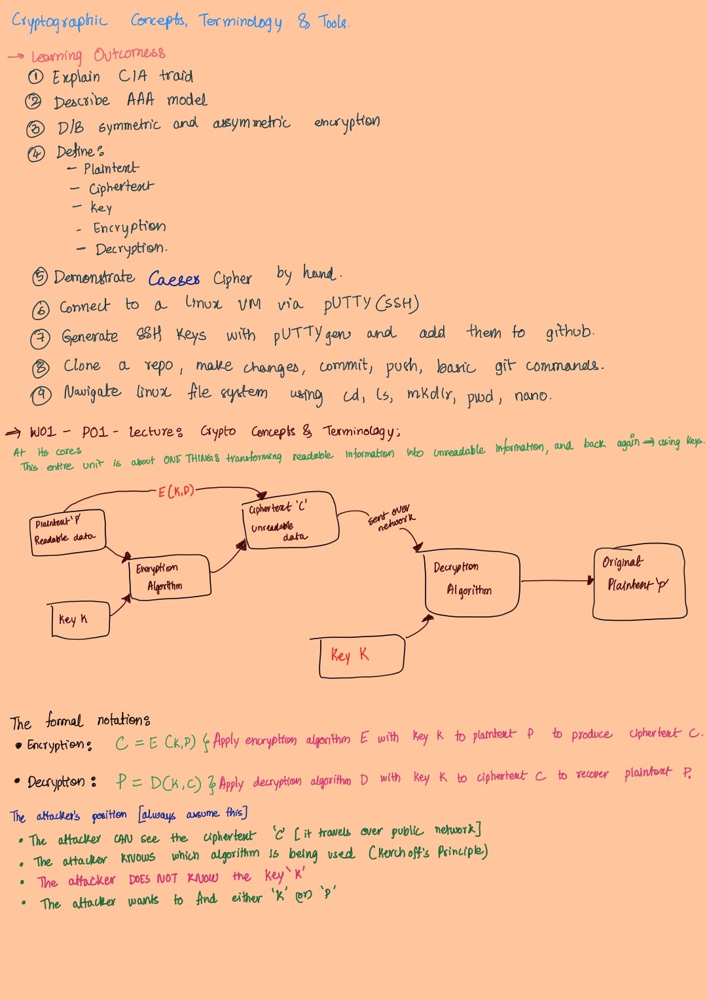
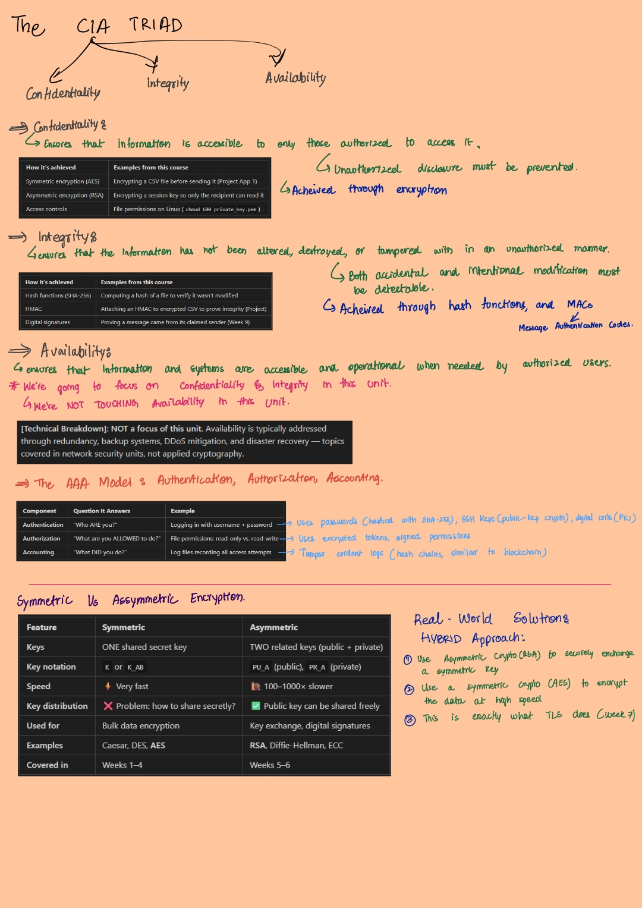
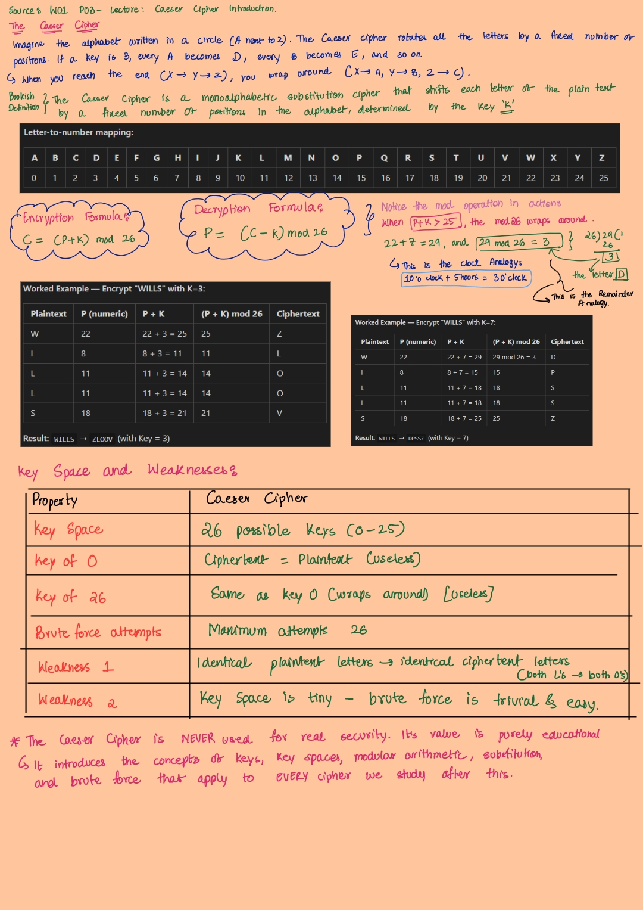
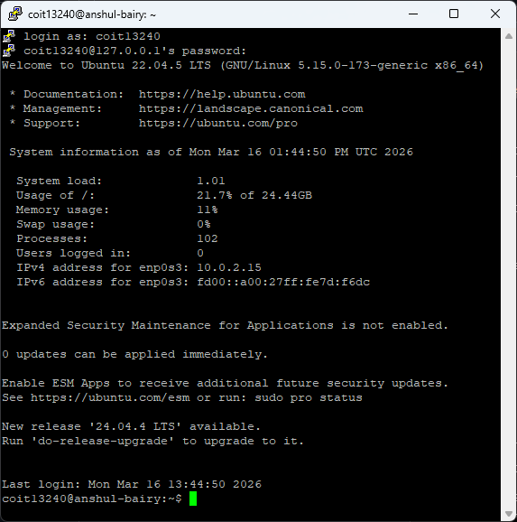

# Week 1

[Return to contents](README.md)

---

## Lecture Notes - Cryptographic Concepts, Terminology & Tools
--
I wrote out all the lecture concepts by hand because I find writing stuff out helps me remember it way better than just reading slides. My notes cover the CIA Triad, AAA Model, the encryption model with the formulas, symmetric vs asymmetric, and Caeser cipher worked examples.

I also used mermaid.js to help me make cleaner flowcharts and tables for my notes since drawing them by hand wasn't hte best for more complex diagrams.

---

## Tutorial Tasks
### Setting up VirtualBox and PuTTY

This part was pretty easy for me. I already had VirtualBox and PuTTY set up from my System and network Admin unit (COIT12146) that I'm also doing this term, so it was just the same thing again. The only thing I had to do was to create another VM on VirtualBox. I've added a new Port forwarding rule with SSH (`127.0.0.1:2201` pointing to guest port `22`).

I've also used LInux before - I rented a server from Oracle Cloud a while back and had to use the command line to set up a VPN on it. I was googling every command back then but it got me comfortable enough with the basics like `cd`, `ls`, `nano` etc.

### SSH Key Generation
