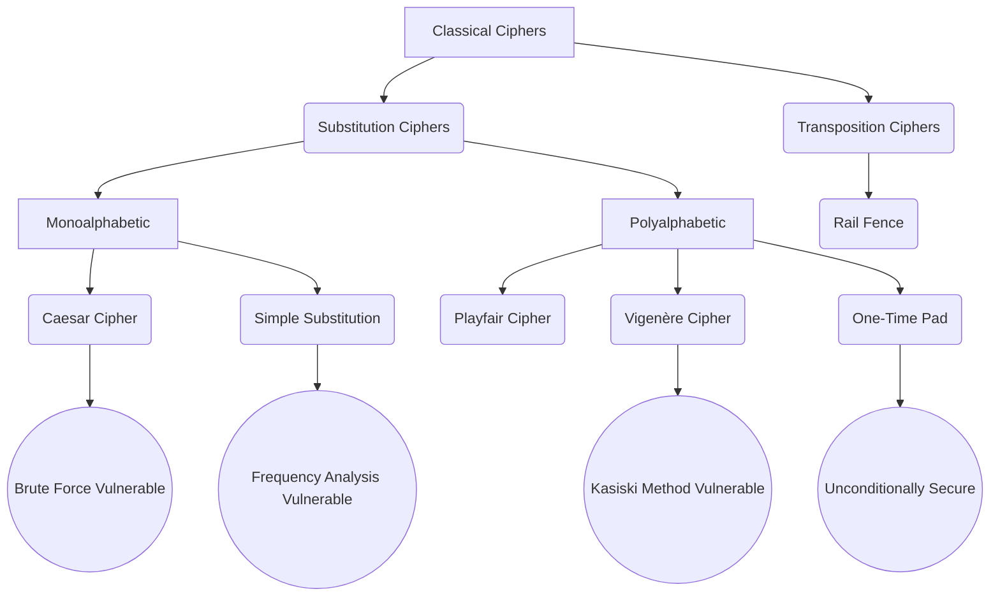
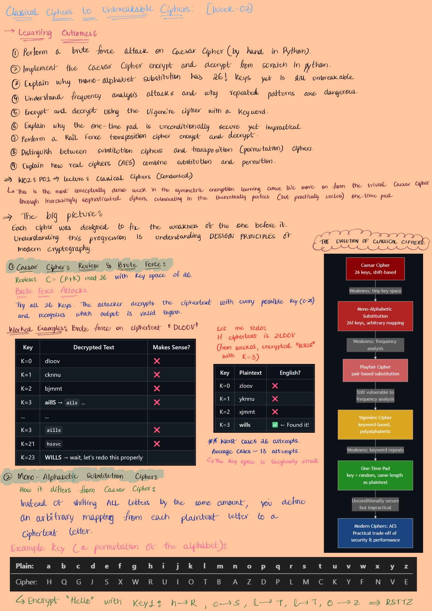
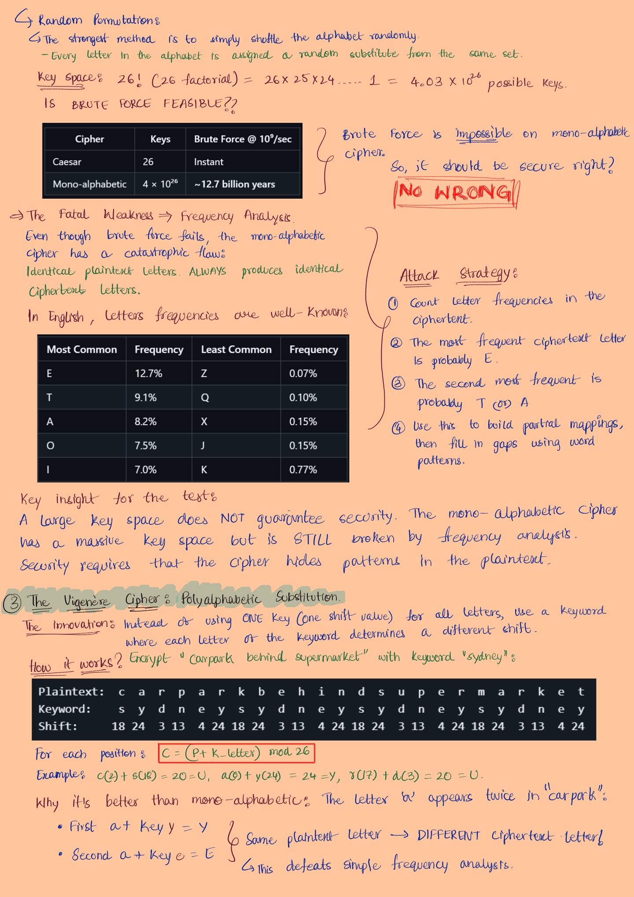
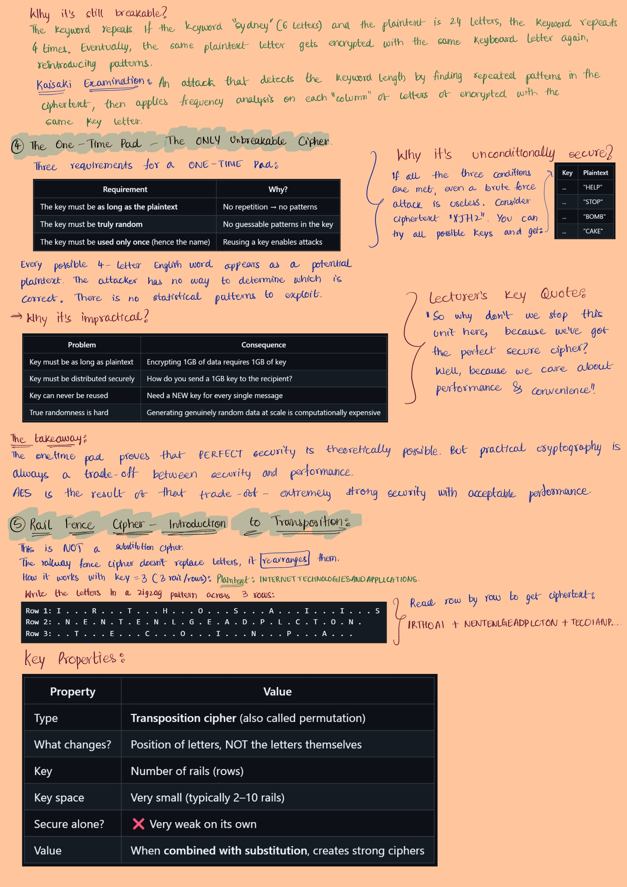
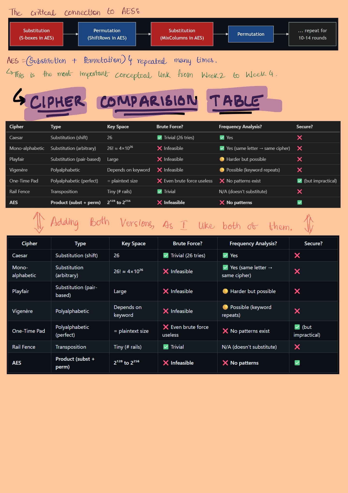

# Week 2: Classical Ciphers & Cryptanalysis
> "The attacker ALWAYS knows the algorithm. Stop trying to hide the math; hide the key."
[Return to contents](README.md)

**My General Overview while skimming through the content at first:**
This week is foundation for everything. If I don't understand *why* classical ciphers failed (e.g., small key space, frequency analysis), I won't understand *why* modern ciphers (AES) are designed the way they are. 

**Time Allocation**
- **Lecture**: 1.5 hours
- **Tutorial Execution (Python Caesar /Rail Fence):** 2 hours
- **Journaling:** 30 min
- **Review & Checklist:** 30 min

---

## 3. 🗺️ Concept Map
> I have used AI to generate this Concept Map (I've used Gemini 3.1 Pro (High) to generate this concept map sourcing my textbook as I like to look at flow charts and mermaid code helps me in building a perfect ADHD friendly flowchart that helps me look at all the concepts at one place.

## Lecture Notes : The Evolution of Ciphers
I wrote all the lecture concepts by hand again because there was so much new stuff to wrap my head around this week. We started with the basic Caesar Cipher and moved up to more complex ones, eventually getting to the One-Time Pad which is technically perfect but basically useless in the real world.

The main thing that clicked for me is that every new cipher was just designed to fix whatever was broken in the previous one. Understanding that progreassion is basically understanding the design principles of modern cryptography.

Here are my hand written notes from this week:

I also included two versions of the Cipher Comparision Table at the end (one table was generated from a markdown file ran on github, and the other was from gemini 3.1) because I actually like having both of them to look back at.

---

## Tutorial Tasks & Cryptanalysis
### 
